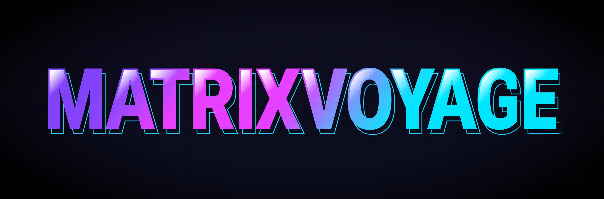
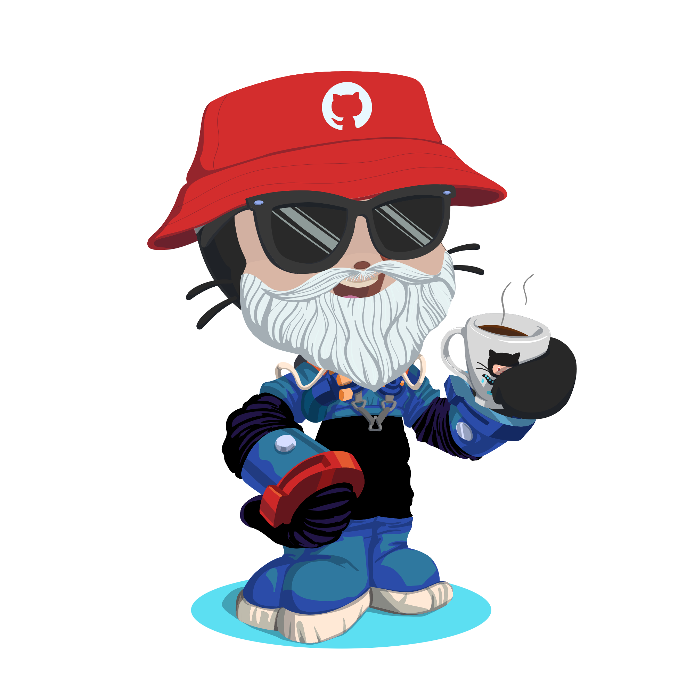
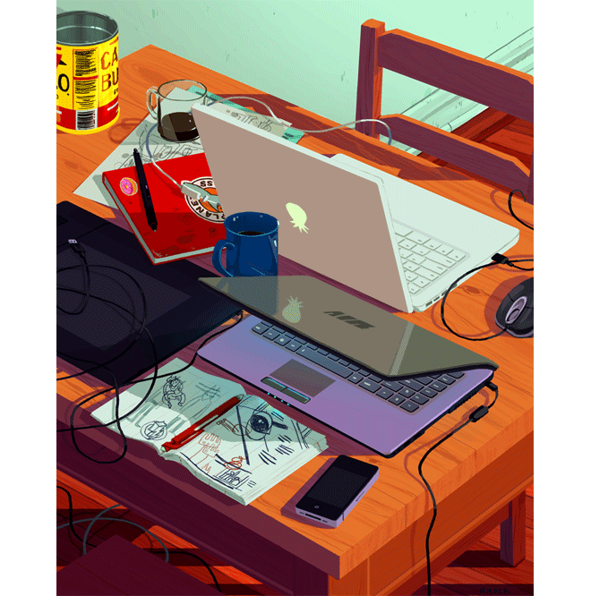

<!--
╔══════════════════════════════════════════════════════════════════════╗
║              MATRIXVOYAGE — GITHUB PROFILE README                    ║
╠══════════════════════════════════════════════════════════════════════╣
║  5-MIN SETUP:                                                        ║
║  1. Repo must be named:  MatrixVoyage/MatrixVoyage                   ║
║  2. Create folder:       assets/                                     ║
║  3. Upload & rename:                                                 ║
║     matrixvoyage-logo.png  ← Gemini_Generated_Image_x0w8...png      ║
║     pixel-setup.gif        ← 225813708-98b745f2-...gif              ║
║     octocat.png            ← octocat-1781256155385.png              ║
║     dev-desk.gif           ← 212750680-266fa8aa-...gif              ║
║  4. Snake animation → see SNAKE SETUP comment below                 ║
╚══════════════════════════════════════════════════════════════════════╝
-->

<!-- ░░ HEADER WAVE ░░ -->

  

<!-- ░░ MATRIXVOYAGE LOGO ░░ -->

  

 

<!-- ░░ TYPING SVG ░░ -->

  

 

<!-- ░░ QUICK BADGE ROW ░░ -->

  
  &nbsp;
  
  &nbsp;
  
  &nbsp;
  

 

<!-- ══════════════════════════════════════════════════════════ -->
<!--                   PIXEL ART BANNER                        -->
<!-- ══════════════════════════════════════════════════════════ -->

  

 

---

<!-- ══════════════════════════════════════════════════════════ -->
<!--                    ABOUT SECTION                          -->
<!-- ══════════════════════════════════════════════════════════ -->

## 💫 Loading Profile...

<table>
<tr>
<td valign="top" width="57%">

<pre>
> whoami
  Hemant Gaurav  |  @MatrixVoyage
  B.Tech IT  ·  IIIT Allahabad  ·  2nd Year

> cat current_status.json
  {
    "mission"  : "🎯 Internship Hunt 2025",
    "cp_rank"  : "2★  CodeChef",
    "vibe"     : "Engineering depth + Polished UI",
    "status"   : "Perfecting 'sometimes works' ™"
  }

> ls active_builds/
  SkillSphere-V2/   NetSentinel/
  GitPulse/         friday-ai-agent/
  VoxelEngine/      MatrixLoader.tsx

> cat philosophy.txt
  Build things that make people go:
  "wait... you made this yourself?"

> _
</pre>

- 🧠 Convincing computers to do what I **mean**, not what I type
- 🔨 Full-stack systems where every layer gets obsessive attention
- 🎮 C++/OpenGL voxel worlds & Unity experiments on weekends
- 🤝 Open to collabs, brutal feedback & being PR-humbled
- 🙃 My compiler is genuinely faster than I am

</td>
<td valign="top" width="43%" align="center">

 

  

</td>
</tr>
</table>

 

---

<!-- ══════════════════════════════════════════════════════════ -->
<!--                     TECH STACK                            -->
<!-- ══════════════════════════════════════════════════════════ -->

## ⚡ Tech Matrix

**`[ Languages ]`**

 

**`[ Frontend ]`**

 

**`[ Backend & Data ]`**

 

**`[ Tools & Platforms ]`**

 

---

<!-- ══════════════════════════════════════════════════════════ -->
<!--                   GITHUB ANALYTICS                        -->
<!-- ══════════════════════════════════════════════════════════ -->

## 📊 Matrix Analytics

&nbsp;

  

 

---

<!-- ══════════════════════════════════════════════════════════ -->
<!--                   ACTIVITY GRAPH                          -->
<!-- ══════════════════════════════════════════════════════════ -->

## 📈 Neural Activity

  

 

---

<!-- ══════════════════════════════════════════════════════════ -->
<!--                    TROPHY ROOM                            -->
<!-- ══════════════════════════════════════════════════════════ -->

## 🏆 Achievement Unlocked

  

 

---

<!-- ══════════════════════════════════════════════════════════ -->
<!--                 TOP CONTRIBUTED REPOS                     -->
<!-- ══════════════════════════════════════════════════════════ -->

## 🔝 Top Contributions

  

 

---

<!-- ══════════════════════════════════════════════════════════ -->
<!--                  FEATURED PROJECTS                        -->
<!-- ══════════════════════════════════════════════════════════ -->

## 🚀 Featured Builds

<b>🛡️ NetSentinel — Privacy-First Network Security Platform</b>

 

> **Stack:** Python · FastAPI · PostgreSQL · Scapy · Next.js

Real-time packet analysis engine with anomaly detection and traffic visualization.
Privacy-first by design — because who watches the watchmen?

 

<b>📊 GitPulse — Developer Analytics Dashboard</b>

 

> **Stack:** React 18 · Node.js · MySQL · GitHub OAuth · Recharts

Commit quality scoring (0–10 across 5 dimensions) + Developer Identity Score + Recruiter Mode public profiles.
Your git history, finally telling a story worth reading.

 

<b>🔗 SkillSphere V2 — Proof-of-Work Matchmaking Engine</b>

 

> **Stack:** React 18 · Supabase · PostgreSQL · Upstash Redis · Socket.IO

Blind code auditions with cryptographic anonymity guarantees.
Get matched on what you can build — not where you studied or what your photo looks like.

 

<b>🎮 VoxelEngine — C++/OpenGL Procedural World Engine</b>

 

> **Stack:** C++ · OpenGL · GLSL · BSP Trees · Structural Physics Sim

Custom voxel engine with structural integrity physics, BSP dungeon injection & GLSL shader hot-reloading.
Started as a Python prototype. Then I decided it needed to be *fast*.

 

 

---

<!-- ══════════════════════════════════════════════════════════ -->
<!--                 CONTRIBUTION SNAKE                        -->
<!-- ══════════════════════════════════════════════════════════ -->

## 🐍 Devouring the Green Squares

  <picture>
    <source media="(prefers-color-scheme: dark)" srcset="https://raw.githubusercontent.com/MatrixVoyage/MatrixVoyage/output/github-contribution-grid-snake-dark.svg"/>
    <source media="(prefers-color-scheme: light)" srcset="https://raw.githubusercontent.com/MatrixVoyage/MatrixVoyage/output/github-contribution-grid-snake.svg"/>
    
  </picture>

<!--
╔══════════════════════════════════════════════════════════════════════╗
║                       SNAKE SETUP (2 min)                           ║
╠══════════════════════════════════════════════════════════════════════╣
║  Create: .github/workflows/snake.yml                                ║
║  Paste the following content:                                        ║
║                                                                      ║
║  name: Generate Snake                                               ║
║  on:                                                                ║
║    schedule:                                                        ║
║      - cron: "0 */12 * * *"                                         ║
║    workflow_dispatch:                                               ║
║  jobs:                                                              ║
║    generate:                                                        ║
║      runs-on: ubuntu-latest                                         ║
║      steps:                                                         ║
║        - uses: Platane/snk@v3                                       ║
║          with:                                                      ║
║            github_user_name: ${{ github.repository_owner }}        ║
║            outputs: |                                               ║
║              dist/github-contribution-grid-snake.svg               ║
║              dist/github-contribution-grid-snake-dark.svg          ║
║              ?palette=github-dark                                   ║
║        - uses: crazy-max/ghaction-github-pages@v3                  ║
║          with:                                                      ║
║            target_branch: output                                    ║
║            build_dir: dist                                          ║
║          env:                                                       ║
║            GITHUB_TOKEN: ${{ secrets.GITHUB_TOKEN }}               ║
╚══════════════════════════════════════════════════════════════════════╝
-->

 

---

<!-- ══════════════════════════════════════════════════════════ -->
<!--                    CONNECT SECTION                        -->
<!-- ══════════════════════════════════════════════════════════ -->

## 🌐 Find Me in the Matrix

 

---

<!-- ══════════════════════════════════════════════════════════ -->
<!--                       QUOTE                               -->
<!-- ══════════════════════════════════════════════════════════ -->

  

 

<!-- ░░ FOOTER WAVE ░░ -->

  

---

*Engineered with obsessive attention to detail · Powered by caffeine & compiler errors*

